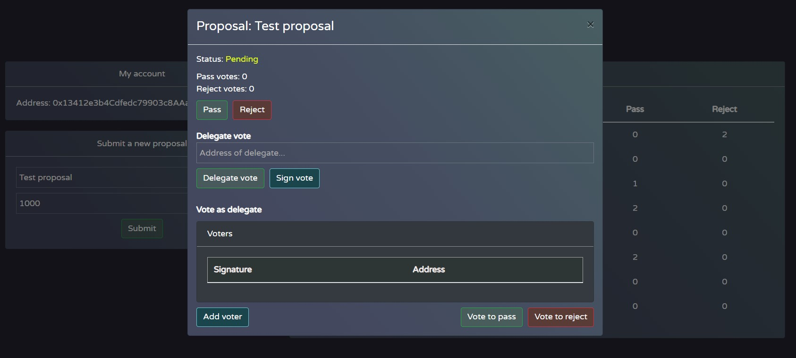

# Votr

## Description

A React app and smart contracts for feeless voting via delegates. Smart contracts were built test first with Truffle tests. The React app is in TypeScript bootstrapped by create-react-app. Communication with the smart contract is via web3js. The app supports on-chain and off-chain delegation of votes to another address, as well as regular voting.

## Motivation

In a world where governance tokens are appearing left and right along with the rising gas prices, a regular user will find it very damaging to their account balance to vote on every single proposal.

One of the solutions to that can be voting off-chain via delegates. 

Why delegates? 

With a single user holding dozens of governance tokens, it is improbable that an average user can find the time to do due diligence on every single proposal. That being the case, it makes sense to delegate your vote to a person in the space you trust.
 By moving the delegation off-chain, users can still contribute their vote without ever paying transaction costs. Instead, those fees can be offloaded to delegates who, I believe, are sufficiently incentivized to submit those votes on-chain.

## Time-Frame 

~10 hours.

## Features
Within the app, the user can: 
- Submit a new proposal with a voting period that lasts the specified amount of seconds
- View all submitted proposals, their status, and vote counts
- Vote to pass or reject a proposal (can only be done within the voting period)
- Delegate their vote to another person's address who will vote on their behalf (on-chain)
- Sign their voting rights for a proposal and give the signed message to a delegate to vote for them (off-chain)
- A delegate can submit other people's signed messages as votes in a single transaction along with their vote

## Setup 

Prerequisites: Truffle, NPM, MetaMask

To start a development blockchain, run the following in the root directory:
```
truffle develop
```
It will start a new dev blockchain and open up the Truffle console. After that, in the truffle console, you can run:
```
test
```
to execute the Truffle tests
and:
```
migrate
```
to deploy the smart contracts.

Before starting the React app, go into the "app" directory and run:
```
npm install
```
to install the node dependencies.
Once it is finished, you can run:
```
npm start
```
To start the web app on localhost:3000

## Future improvements
- Extend the proposal struct to contain a description of the proposal and display it in the proposal modal. Without it, there's no way of knowing what a proposal suggests (if it's not clear from its name)

- Add the address of the person who submitted the proposal to the proposals table

- Implement actual error handling for MetaMask

- Components should refresh properly after transaction submission e.g., after voting, the vote should be reflected in the vote count without the need for a page refresh

- Use a safer version of message signing. One that shows the user in MetaMask the exact thing they are signing instead of just a hash of the message

- Governance token implementation or some other way of assigning voting rights to addresses instead of the current implementation where every address can vote

- Delegation of votes for all future proposals (until disabled) instead of per proposal delegation

- More truffle tests. I've covered most cases, but there are perhaps some exploits I've missed

## How to use the app

Once the app starts and you confirm the connection in MetaMask, you will see this screen.


In the top left corner, you can see the address of your MetaMask account. Below that, there is a form you can use to submit new proposals. Just fill in the name and duration and click submit.


MetaMask will ask you to confirm the transaction. Click confirm, and after it's processed, you will see it appear in the bottom of the table on the right.


You can then click on the proposal in the table to open a proposal modal.



Here you can see the name of the proposal, its status (Pending, Tied, Rejected, and Passed), and the number of votes for both options (to pass or to reject).
Below the info, you have two buttons: Pass and Reject. You can use them to vote on the proposal. MetaMask will, of course, ask you to confirm the transaction.

Next, we have the input for the address of the person you choose to delegate your vote to. It can be any address. Once you input that and click "Delegate vote" and confirm the transaction, the contract will vote for the same option your delegate voted for or, if they haven't yet voted, give your vote to them. This is the on-chain delegation of your vote, so, ofcourse, you will have to pay the gas costs.


To delegate your vote off-chain, you can instead click the "Sign vote" button. MetaMask will ask you to sign the message. Click "Sign".

After signing, a text area will appear with your signed message in JSON. Copy that message and give it to your delegate via DM, Email, a pigeon, or whatever way you choose to communicate.


As a delegate, you can use the signed message JSON to vote on the person's behalf. To do so, click on add voter and paste the JSON in the input of the signature column.


After pasting the JSON, you will see the address of the person who delegated their vote to you in the input of the address column.


To vote on their (and your) behalf, click on "Vote to pass" or "Vote to reject". If you have more signed messages from other people, you can add more "voters" and submit all of the votes in one transaction. 


After confirming the transaction in MetaMask (and refreshing the page because I haven't made the UI update after the transaction goes through), you will see the current proposal will have two votes for whatever option you voted on. That's because it's counting your vote along with those you voted for as a delegate. 


You can also see the votes in the proposals table.
